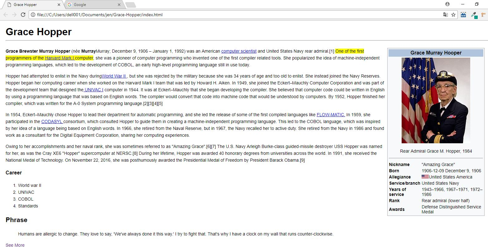

# Replicando la página de Grace Hopper de wikipedia

* En el siguiente proyecto se construyo una réplica de la página de Grace Hopper de wikipedia: https://en.wikipedia.org/wiki/Grace_Hopper utilizando una estructura semántica de HTML (index.html) y todas las bondades de CSS  (css/main.css) para representar el diseño lo más fiel posible.

* Creditos: Jennifer Carmen
